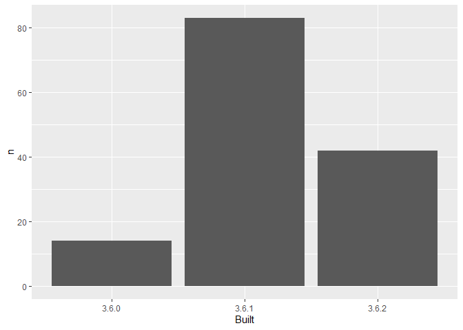

03\_barchart-packages-built.R
================
jkee2
2020-01-27

``` r
## remember to restart R here!

## make a barchart from the frequency table in data/add-on-packages-freqtable.csv

## read that csv into a data frame
## hint: readr::read_csv() or read.csv()
## idea: try using here::here() to create the file path
library(here)
```

    ## here() starts at C:/Users/jkee2/Desktop/What They Forgot to Teach You About R/04_git-and-github-early-usage/packages-report

``` r
apt_freqtable <- readr::read_csv(here("data", "add-on-packages-freqtable.csv"))
```

    ## Parsed with column specification:
    ## cols(
    ##   Built = col_character(),
    ##   n = col_double(),
    ##   prop = col_double()
    ## )

``` r
## if you use ggplot2, code like this will work:
library(ggplot2)
ggplot(apt_freqtable, aes(x = Built, y = n)) +
  geom_col()
```

<!-- -->

``` r
## write this barchart to figs/built-barchart.png
## if you use ggplot2, ggsave() will help - this saves the last created plot
## idea: try using here::here() to create the file path
ggsave(here("figs", "built-barchart.png"))
```

    ## Saving 7 x 5 in image

``` r
## YES overwrite the file that is there now
## that's old output from me (Jenny)
```
